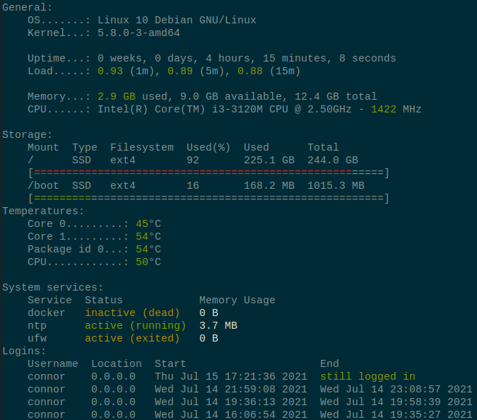

# sysstatus
A small fast tool to get an overview of the system including load, storage usage, temperature and services.



## Installation
### Source
- Clone the repository `git clone git@github.com:scratchcat1/sysstatus.git`
- Move into the repository `cd sysstatus`
- Build with `cargo build`
- Run with `cargo run` or `cargo run --release`
- (Optional) Use a different config file using `cargo run -- -c /path/to/config.json`

# Options
```
sysstatus 0.1.0

USAGE:
    sysstatus [OPTIONS]

FLAGS:
    -h, --help       Prints help information
    -V, --version    Prints version information

OPTIONS:
    -c, --config-file-path <config-file-path>    Path to configuration file [default: resources/config.json]
```

## Configuration
`sysstatus` requires a configuration file to run, by default looking for `./resources/config.json`.
To specify a config file manually use `sysstatus -c /path/to/config.json`.

### Colors
Colors must use values which deserialise to a `colored::Color`, see the enum [here](https://docs.rs/colored/2.0.0/colored/enum.Color.html).
Valid examples include `"Black"`, `"BrightCyan"` and `{
    "TrueColor": {
        "r": 3,
        "g": 4,
        "b": 255
    }
}`

### Conditional Colour
`ConditionalColour` allows text colours to be selected dynamically depending on the value of the attribute. Each `ConditionalColour` has a default colour and zero or more `ColourLevel` resulting in a definition as follows:
```json
{
    "default_colour": "Green",
    "levels": [
        {
            "min": 0.5,
            "colour": "Yellow"
        },
        {
            "min": 0.8,
            "colour": "Red"
        }
    ]
}
```
`ConditionalColour`s are evaluated by selecting the furthest colour down the list for which the comparison value is greater than or equal to `min`. The `min` of each level must increase as the list is traversed or behaviour is undefined.

In the example:
- 0.1 => Green
- 0.49 => Green
- 0.5 => Yellow
- 0.7 => Yellow
- 0.8 => Red
- 10.0 => Red

### Example config (with explanations)
```jsonc
{
    "general_info": {
        // ConditionalColour for load average. Comparison value = load / cores.
        "load_avg": {
            "default_colour": "Green",
            "levels": [
                {
                    "min": 0.5,
                    "colour": "Yellow"
                },
                {
                    "min": 0.8,
                    "colour": "Red"
                }
            ]
        },
        // Conditional Colour for memory usage. Comparison value = used / total.
        "memory": {
            "default_colour": "Green",
            "levels": [
                {
                    "min": 0.7,
                    "colour": "Yellow"
                },
                {
                    "min": 0.9,
                    "colour": "Red"
                }
            ]
        },
        // ConditionalColour for CPU frequency. Comparison value = CPU frequency in MHz.
        "cpu_frequency": {
            "default_colour": "Green",
            "levels": [
                {
                    "min": 2000,
                    "colour": "Yellow"
                },
                {
                    "min": 2400,
                    "colour": "Red"
                }
            ]
        }
    },
    "storage": {
        // ConditionalColour for colouring the usage bars of storage usage. Comparison value = used / total.
        "usage_colouring": {
            "default_colour": "Green",
            "levels": [
                {
                    "min": 0.8,
                    "colour": "Yellow"
                },
                {
                    "min": 0.9,
                    "colour": "Red"
                }
            ]
        },
        "exclude_prefixes": [
            "/var/lib/docker/"
        ]
    },
    // ConditionalColour for temperature. Comparison value = temperature of component.
    "temperature": {
        "default_colour": "Green",
        "levels": [
            {
                "min": 70,
                "colour": "Yellow"
            },
            {
                "min": 85,
                "colour": "Red"
            }
        ]
    },
    // Map of service names to service configurations
    // The ending .service is not needed.
    "services": {
        "docker": {
            // ConditionalColour for memory usage of service. Comparison value = memory usage in bytes.
            "memory_usage": {
                "default_colour": "White",
                "levels": [
                    {
                        "min": 2000,
                        "colour": "Yellow"
                    },
                    {
                        "min": 2400,
                        "colour": "Red"
                    }
                ]
            }
        },
        "ntp": {},
        "ufw": {}
    },
    // Configuration for last login section.
    "last_login": {
        // Optionally only include logins which occur before a certain time.
        // Accepts any value which `last --since` accepts e.g. `+5days`, `yesterday`.
        "since": "yesterday",

        // Mapping of usernames to fetch the last logins for to the configuration for that user's last login.
        "users": {
            "pi": {
                // Optionally limit the maximum number of logins shown of the user.
                "max_lines": 4
            },
            "root": {
                // Optionally set the colour of the username.
                "username_colour": "Red"
            }
        }
    }
}
```

## Alternatives
- [motd](https://github.com/yboetz/motd) - "Collection of my 'Message of the Day' scripts" by yboetz
- [rust-motd](https://github.com/rust-motd/rust-motd) - "Beautiful, useful MOTD generation with zero runtime dependencies" by rust-motd

## Acknowledgements
This program is partly derived from `rust-motd` particularly in regards to formatting and handling last login parsing.